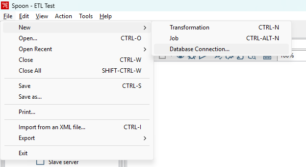
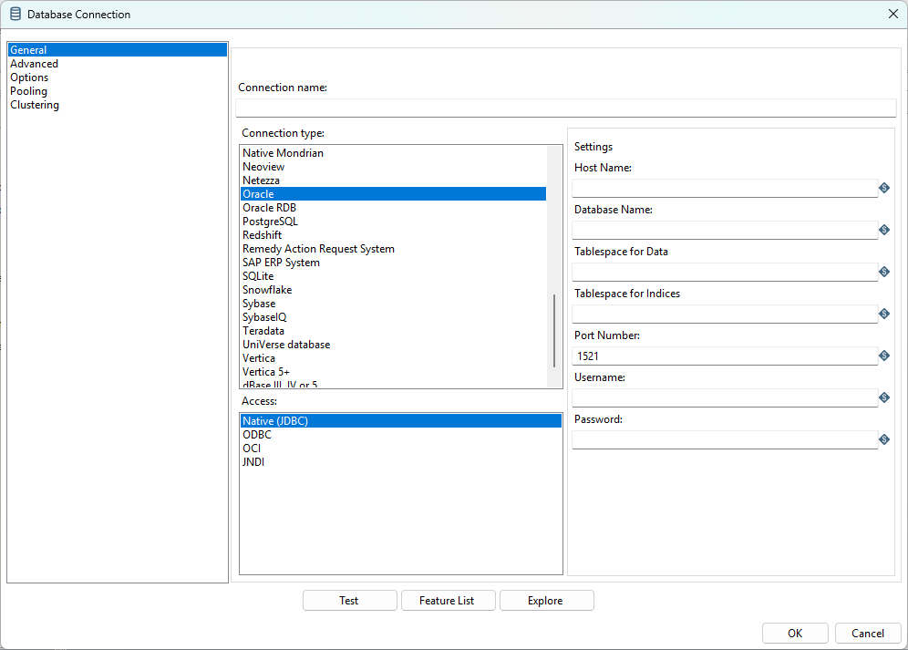
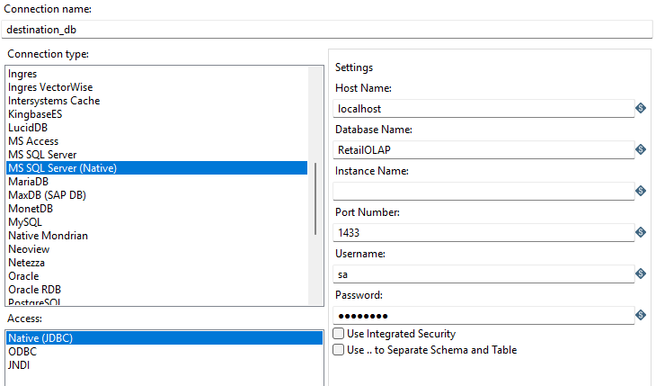
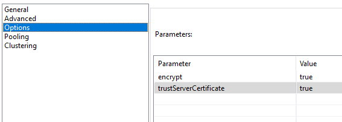
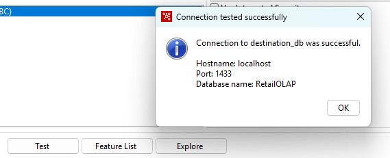
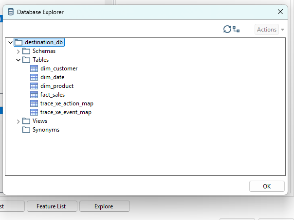
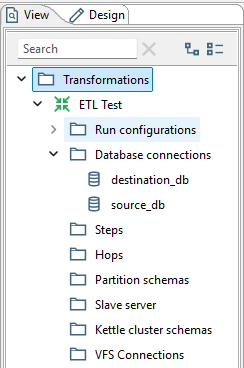
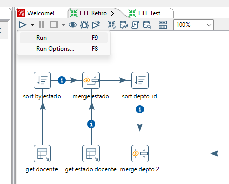

# ETL con Pentaho Data Integration

Se eligió trabajar con Pentaho Data Integration para el ETL de bases de datos, principalmente porque posee una versión gratuita que es el "Community Edition", además de que es Open Source.

## Instalación de Drivers

Se está trabajando con bases de datos que son de SQL Server. Esto significa que tenemos que instalar el driver para que Pentaho pueda trabajar con las bases de datos. Para ello, utilizamos **Microsoft JDBC Driver para SQL Server**, descargando el archivo .zip que se encuentra en el siguiente link:

- [Descargar driver](http://learn.microsoft.com/es-es/sql/connect/jdbc/download-microsoft-jdbc-driver-for-sql-server?view=sql-server-ver16)

Se tiene que descomprimir el archivo .zip en un directorio temporal, y dentro de este navegamos hacia la siguiente dirección `sqljdbc_<version>\sqljdbc_12.8\enu\auth\x86` en donde se encuentra el archivo `mssql-jdbc_auth-12.8.1.x86.dll`. Copiamos este archivo, y lo pegamos en el directorio `C:\Program Files\Java\jdk-24\bin`; o a la carpeta `bin` donde se encuentra la carpeta del entorno de java que se está trabajando.

Luego, copiamos el archivo `mssql-jdbc-12.8.1.jre11.jar` que se encuentra en `sqljdbc_<version>\sqljdbc_12.8\enu\jars` y lo pegamos en la carpeta de las librerías de Pentaho, en la dirección donde se haya instalado: `..\pentaho-data-integration ce\lib`. Puede que el nombre de la carpeta de Pentaho cambie, así que la dirección brindada no funcione.

## Conexiones con bases de datos

Ejecutamos el archivo `Spoon.bat` y creamos un archivo para hacer una transformación de datos. Para ello, nos vamos al menu `File > New > Transformation`, o bien usamos el atajo `ctrl+N`. Dentro del archivo, para crear una conexión con una base de datos nos dirigimos al menú `File > New > Database Connection` en donde nos aparecerá la siguiente ventana:

En esta ventana le damos un nombre a la conexión, seleccionamos el tipo de conexión como "SQL Server (Native)". Ya que la base de datos la estamos trabajando de manera local, el nombre del host es `localhost`. 
Seleccionamos el nombre de la base de datos, el puerto en el que está funcionando el contenedor de Docker, el nombre de usuario y contraseña. El acceso a utilizar el JDBC nativo.

Además, nos dirigimos a la pestaña de opciones para agregar los siguientes parámetros:

- `encrypt = true`
- `trustServerCertificate = true`

Realizar estos pasos debería ser suficiente para tener una conexión exitosa con la base de datos.

Las conexiones hechas se pueden ver en la pestaña de Vista al lado de la zona de trabajo.

## Ejecutar ETL

Con el archivo que se encuentra aquí, lo abrimos con Pentaho Data Integration en el menú `File > Open`. Una vez abierto el archivo y arregladas las conexiones con las bases de datos que se encuentran en la pestaña Vista (a la cual se le tendría que cambiar usuario y contraseña), en el lienzo le damos click a "Run"

